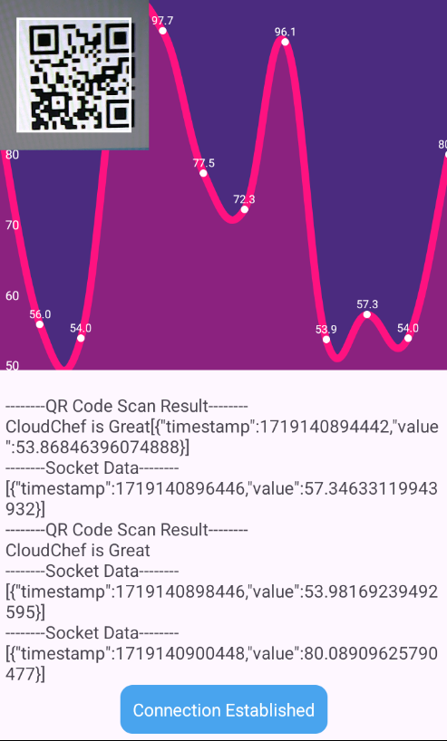

<h1>This project is a basic Android application that communicates with a local server using <strong>reliable</strong>, <strong>low-latency</strong> commmunication protocal.</h1>

<br/><br/>

# Project
## 1. Android Application
The app maintains an active connection with the server using [Socket.IO](https://socket.io/).

The app keeps the front camera active for scanning QR/bacords using [zxing](https://zxing.org/).

## 2. Server Application
The server sends messages to the connected Android devices every 2 seconds using [Socket.IO](https://socket.io/).

The server uses [Redis](https://redis.io/) to cache the data to protect data loss and to increase server performance.

# Tech Stacks
## 1. Android Application
- Android Studio Kotlin
- Socket.IO
- Zxing

## 2. Server Application
- Node.js
- Yarn
- Redis
- Socket.IO

# User Guide
## 1. Android Application
- Install Android Studio and your Android Emulator Ready(Android Studio Emulator, Nox, LDPlayer etc)
- Configure SOCKET_URI in `./android/app/src/main/java/com/cloudchef/assignment/util/Constants.kt`

## 2. Server Application
 - Download or Clone the project

 ```
 git clone https://github.com/fullchain324/cloudchef-assignment.git
 ```
 - Now `cd` into the project directory.

 - Create `.env` file and set configurations.
 ```
 PORT=3030
 REDIS_URL="redis://127.0.0.1:6379"
 REDIS_PASS=
 REDIS_SECONDARY_URL="redis://127.0.0.1:6380"
 REDIS_SECONDARY_PASS=
 REDIS_HOST=
 REDIS_PORT=
 ```
 - Install Dependencies via yarn.
 ```
 yarn install
 ```
 - Compile project and run on development mode.
 ```
 npm run build:compile
 npm run dev
 ```


